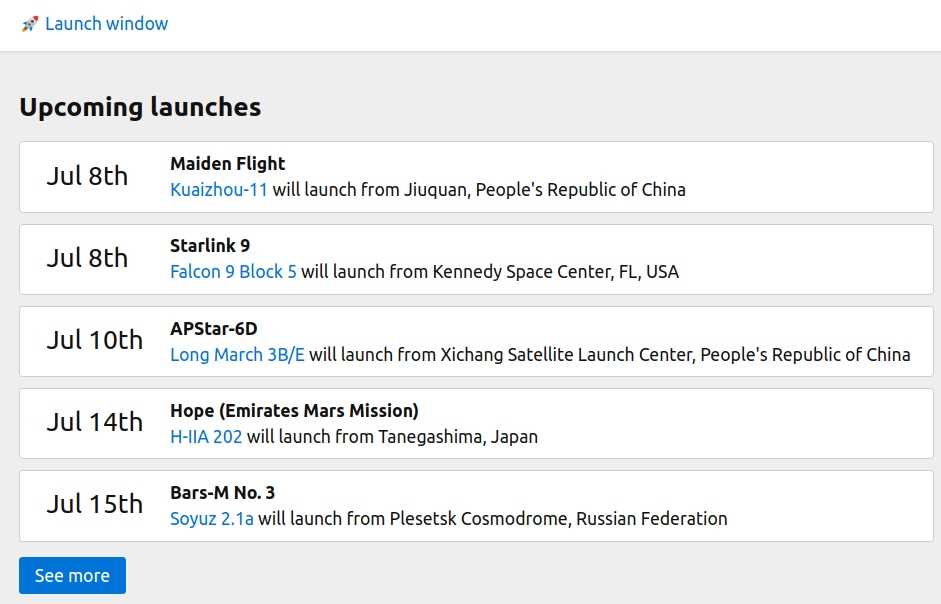

This is a [Next.js](https://nextjs.org/) project bootstrapped with [`create-next-app`](https://github.com/vercel/next.js/tree/canary/packages/create-next-app).

# Launch window - a simple demonstration of server-side rendering with Next.js

This simple web application showcases the various React component rendering approaches supported by Next.js:

## The index page - Server-Side rendering



The index pages shows the next five upcoming rocket launches worldwide using the excellent free [Launch Library API](https://launchlibrary.net/docs/1.4/api.html), with an option to fetch more.

The page is rendered on server with each request - the HTML page fetched from server already contains all the content and is easily processable by web indexers.
The react components are hydrated afterwards, which allows the "See More" button to work the usual React way - by updating component state based on AJAX call results. 

How it works:
* The `getServerSideProps` method in [index.tsx](pages/index.tsx) tells Next.js how it should populate the props of the `Home` component on each request. This also tells Next.js that we want to use server-side rendering for this page. 
* The `Home` component itself stores the inital props into it's own state and can update this state based on user actions as is usual in React.
* The `fetchUpcomingLaunches` method for getting the data is used both server-side in `getServerSideProps` and client-side in the `fetchMore` function.  

## The rocket detail page - Static pre-rendered pages


These pages have content that is not expected to change often, so they are statically generated *on build time* and can be easily served from CDN.

How it works: 
* The `getStaticProps` method in [rockets/\[rocketId\].tsx](pages/rockets/[rocketId].tsx) tells Next.js that this page can 
be pre-rendered on build time and served statically. It also specifies how to set up the props for the page component based on the route parameters.
* The `getStaticPaths` method tells Next.js the list of routes for which we want to pre-render the pages on build time. 
(the implementation grabs the list of all known rockets from the API).
* The `fallback: true` property returned by `getStaticPaths` tells Next.js that if user visits a route that was not 
pre-rendered on build time (for example a new rocket was added on the API after the webapp was built), we render it 
server side on the fly and add it to the cache of pre-rendered pages. While the page is being rendered server-side,
 client will see a fallback version of the page - this eventuality is handled by the `router.isFallback` check in 
 the `RocketDetail` component.  

## How to run it

### Development mode:
```bash
npm run dev
```
Open [http://localhost:3000](http://localhost:3000) with your browser to see the result.

You can start editing the page by modifying `pages/index.js`. The page auto-updates as you edit the file.

### Production build and deployment on local Node.js server
```bash
npm run build
npm start
```

## Further reading

For a more detailed introduction into Next.js pre-rendering techniques, I recommend the well-written [official documentation](
https://nextjs.org/docs/basic-features/pages#pre-rendering).
